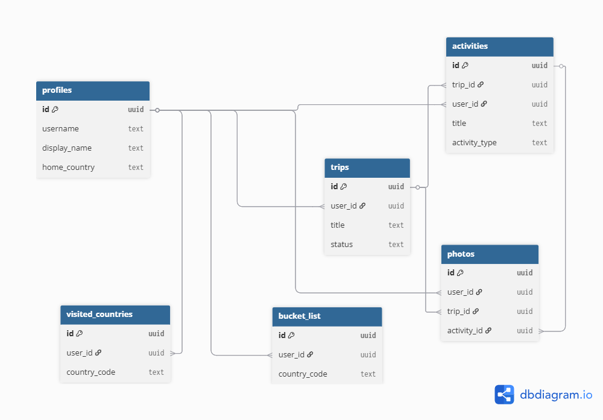

# Roam

Roam er en app for å samle og bevare reiseminner. Målet er å gi brukere et meningsfullt sted å dokumentere reisene sine, ikke bare gjennom bilder, men også gjennom historiene, stedene og følelsene bak dem.

## Teknologi

- Node.js med Express
- Supabase (PostgreSQL, Auth, Storage)
- Vanilla HTML, CSS og JavaScript

## Kom i gang

1. Klon repoet
2. Kjør `npm install`
3. Lag en `.env.local` fil med:
   ```
   PORT=3000
   SUPABASE_URL=din-url
   SUPABASE_SERVICE_ROLE_KEY=din-nøkkel
   ```
4. Kjør `npm start`

> `npm start` er definert i `package.json` og laster miljøvariabler automatisk.

## Datamodell

Databasen har 6 tabeller. Full SQL ligger i `db/roam-supabase.sql`.



[Se interaktivt diagram på dbdiagram.io](https://dbdiagram.io/d/Roam-69cd0b2078c6c4bc7abcf90f)

### profiles
Brukerinfo som utvider Supabase Auth. Lagrer brukernavn, bio, hjemland og avatar.

### trips
Reiser. Hver reise har tittel, beskrivelse, datoer og status (planned/ongoing/completed).

### activities
Opplevelser på en reise. Har type (hike, food, museum osv.), sted, notater og tidspunkt. Kan markeres som høydepunkt.

### photos
Bilder knyttet til reiser eller aktiviteter. Lagres i Supabase Storage, URL-er i databasen.

### visited_countries
Land brukeren har besøkt. Brukes for å fargelegge verdenskartet.

### bucket_list
Land brukeren vil besøke. Vises med stiplet kant på kartet.

## Sikkerhet

- Row Level Security (RLS) på alle tabeller
- Brukere ser kun egne data
- Passord håndteres av Supabase Auth
- Service role key brukes kun server-side

## API-endepunkter

*Kommer når rutene er implementert.*

## Frontend

*Kommer når sidene er bygget.*
